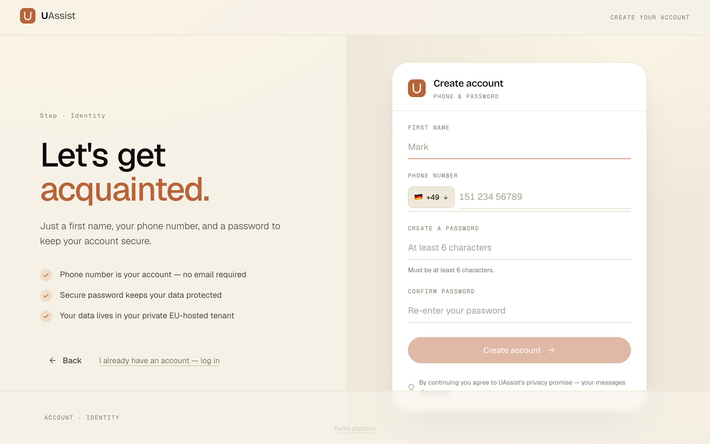

# UAssist

**A unified inbox for WhatsApp, Signal, Email, and Slack.**

UAssist aggregates all your messages from different channels into a single, calm surface. Instead of context-switching between apps, everything lands in one timeline — sorted by time, searchable, and accessible from any device via the web UI.

Each user gets a fully isolated tenant: a dedicated MongoDB database, a dedicated Docker container running their integrations, and end-to-end encryption of all message content at rest.



---

## Features

| Feature | Details |
|---|---|
| **Multi-channel inbox** | WhatsApp, Signal, Email, Slack — merged into one timeline |
| **Real-time streaming** | Messages appear instantly via SSE (Server-Sent Events) |
| **Send from anywhere** | Reply to any channel from the same UI |
| **Encrypted at rest** | AES-256-GCM with per-user keys via AWS KMS envelope encryption |
| **Tenant isolation** | Separate DB + Docker container per user, no data leakage possible |
| **Onboarding flows** | QR scan for WhatsApp, secondary-device link for Signal, IMAP for email, token for Slack |
| **Rate limiting** | Auth endpoints limited to 10 req / 15 min |
| **GeoIP filtering** | API access restricted to European IPs by default |

---

## Demo

A pre-seeded demo account is available on every deploy:

| Field | Value |
|---|---|
| URL | `http://46.225.227.83:3001` |
| Country code | `+49` |
| Phone | `0000000000` |
| Password | `000000` |

Or click **"Demo platform"** on the login screen to sign in automatically. The demo account has pre-populated WhatsApp, Signal, and Email messages that reset on each deploy.

---

## Architecture Overview

```
┌──────────────────────────────────────────────────────────┐
│                        VM (Ubuntu 24.04)                  │
│                                                           │
│  ┌─────────────┐    ┌─────────────┐    ┌──────────────┐  │
│  │  Frontend   │    │     API     │    │   MongoDB    │  │
│  │  (Next.js)  │◄──►│  (Express)  │◄──►│  (per-tenant │  │
│  │  :3001      │    │  :3000      │    │   databases) │  │
│  └─────────────┘    └──────┬──────┘    └──────────────┘  │
│                            │                              │
│              ┌─────────────┼─────────────┐               │
│              ▼             ▼             ▼               │
│     ┌──────────────┐ ┌──────────────┐ ┌──────────────┐  │
│     │tenant-worker │ │tenant-worker │ │tenant-worker │  │
│     │  (user A)    │ │  (user B)    │ │  (user C)    │  │
│     │ WA+Signal+   │ │ WA+Signal+   │ │ WA+Signal+   │  │
│     │ Email+Slack  │ │ Email+Slack  │ │ Email+Slack  │  │
│     └──────────────┘ └──────────────┘ └──────────────┘  │
└──────────────────────────────────────────────────────────┘
```

Three core services run in Docker Compose. Each authenticated user additionally gets their own `tenant-worker` container, spawned dynamically by the API, that handles their integrations.

---

## Quick Start (local frontend + remote API)

```bash
git clone https://github.com/echtermeyer/UAssist
cd UAssist/frontend-app
echo "NEXT_PUBLIC_API_URL=http://<VM_IP>:3000" > .env.local
npm install
npm run dev
```

Open `http://localhost:3001`.

**Full stack (local):**

```bash
cp .env.example .env   # fill in secrets
docker compose up -d
```

---

## Auth

Login uses **phone number + password** (no email required). JWTs are stored in `ua_token` httpOnly cookies (7-day expiry). All endpoints except `/auth/login` and `/auth/signup` require a valid token.

---

## Documentation

| Doc | Contents |
|---|---|
| [Architecture](docs/architecture.md) | System components, data flow, integrations, DB schema |
| [Security](docs/security.md) | Encryption, tenant isolation, auth, network hardening |
| [Deployment](docs/deployment.md) | CI/CD pipeline, env vars, VM setup, local dev |

---

## Integration Tests

```bash
cd api
npm test
# or against a specific host:
API_URL=http://<VM_IP>:3000 node --test test/integration.test.js
```

26 tests covering auth, multi-tenancy, message scoping, send endpoints, onboarding, and SSE streaming.
